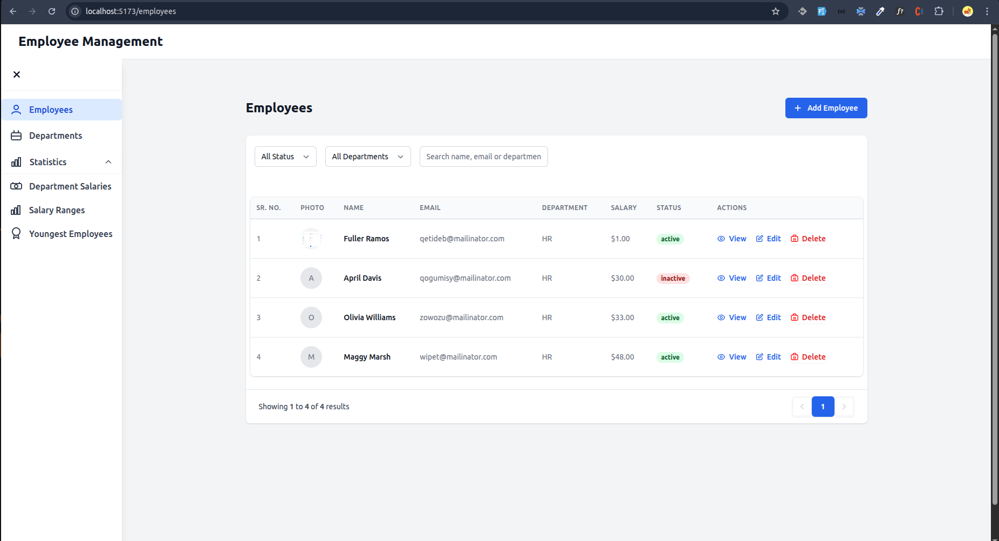
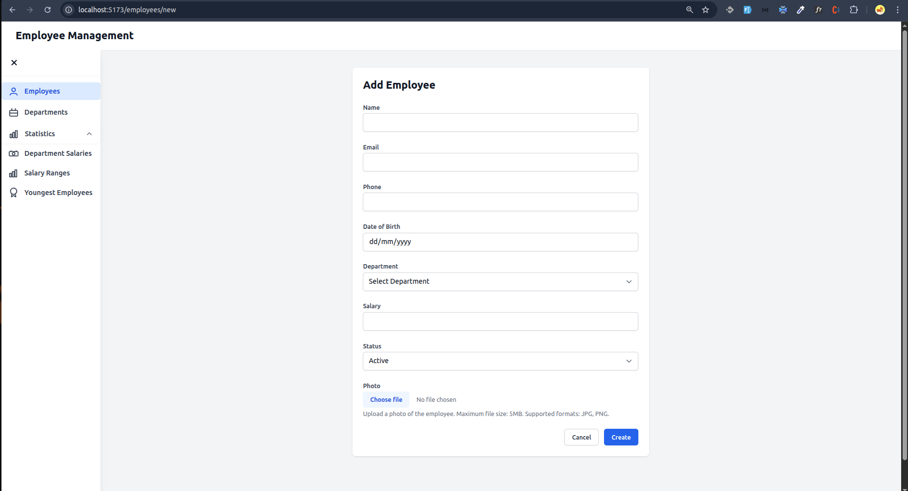
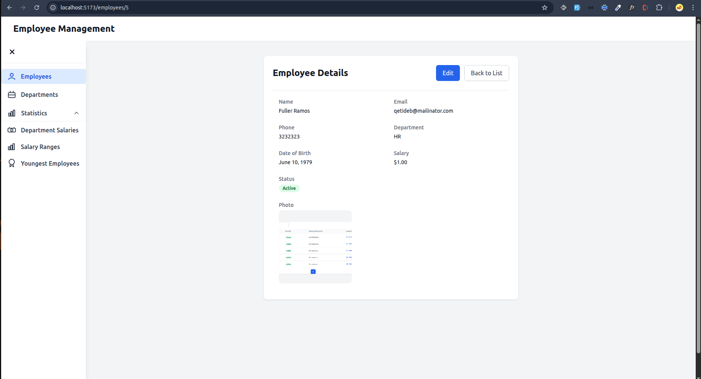
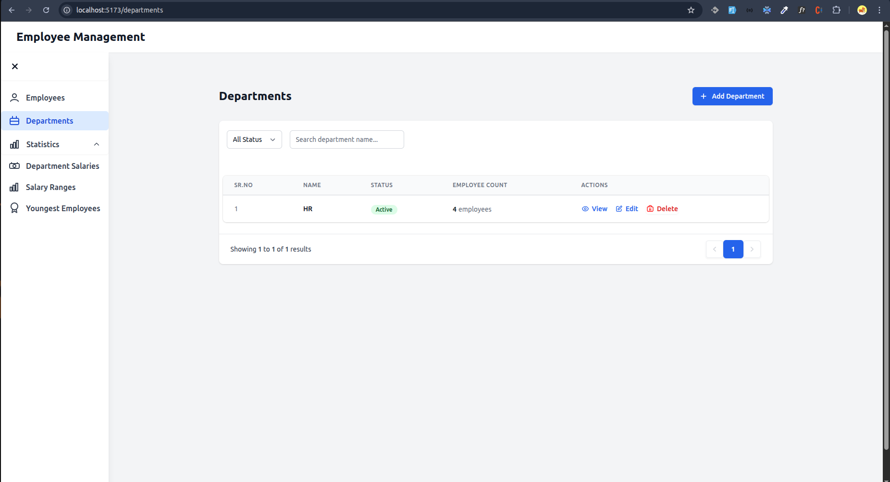
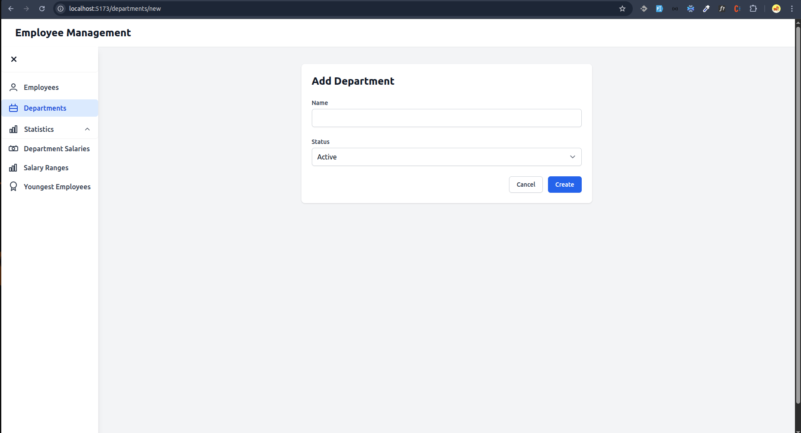
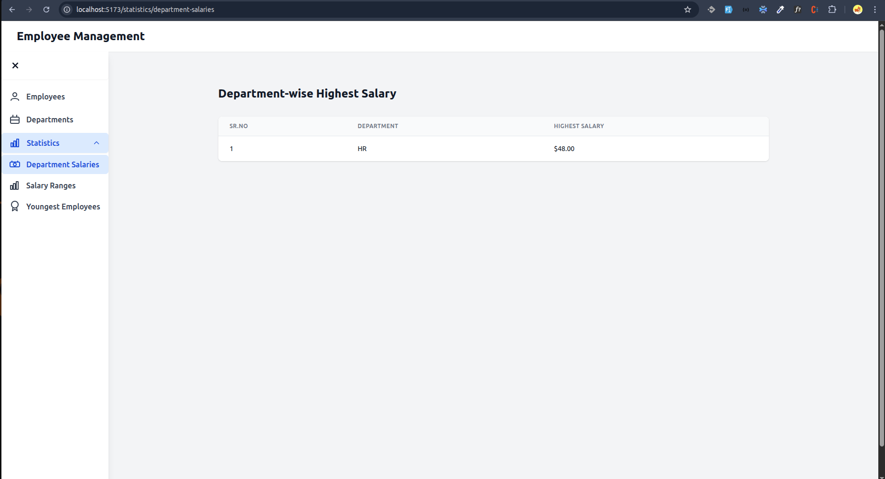
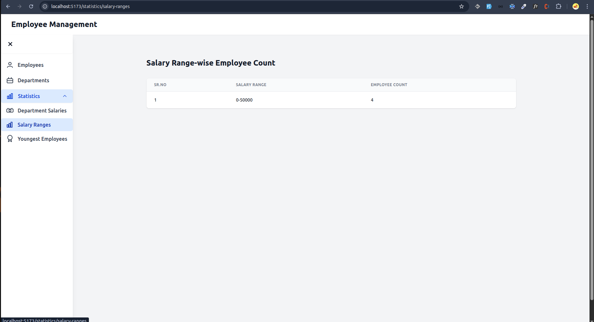
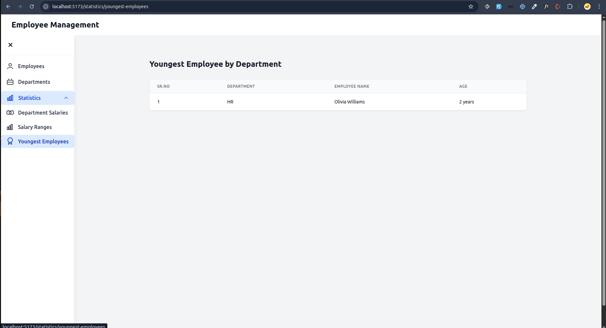

# Employee Management System

A full-stack MERN application for managing employee data with advanced features including photo management, department organization, and detailed employee profiles.

## Application Screenshots

### Employee Management
#### Employee List

*Employee listing with pagination, search, and quick actions*

#### Add Employee

*Comprehensive form for adding new employees with photo upload*

#### Employee Details

*Detailed employee information with photo display*

### Department Management
#### Department List

*Department listing and management interface*

#### Add Department

*Department creation interface*

### Statistics and Analytics
#### Performance Metrics

*Key performance indicators and metrics*

#### Department Analytics

*Department-wise analysis and trends*

#### Employee Distribution

*Employee distribution and demographic analysis*

## Features

- **Employee Management**:
  - Comprehensive employee listing with pagination and filters
  - Add/Edit/Delete employee records
  - Advanced search functionality (by name, email, or department)
  - Employee status tracking (active/inactive)
  - Professional photo management with preview
  - Detailed employee profiles

- **Photo Management**:
  - Upload and store employee photos
  - Automatic image processing and optimization
  - Fallback avatars with employee initials
  - Thumbnail generation for list views
  - Responsive image display across all views

- **Department Management**:
  - Department-wise organization
  - Employee distribution tracking
  - Department-based filtering

- **Advanced Statistics**:
  - Department-wise highest salary analysis
  - Salary range distribution
  - Age demographics by department
  - Employee status distribution

## Tech Stack

- **Frontend**: 
  - React.js with TypeScript
  - TanStack Query (React Query) for data fetching
  - Tailwind CSS for modern, responsive styling
  - Vite for fast development and building

- **Backend**: 
  - Node.js & Express.js
  - MySQL database
  - Multer for file uploads
  - Sharp for image processing

- **Other Tools**: 
  - Joi for validation
  - Environment configuration
  - TypeScript for type safety

## Project Structure

```
├── client/                 # Frontend React application
│   ├── src/
│   │   ├── @types/        # TypeScript interfaces
│   │   ├── components/    # Reusable UI components
│   │   ├── config/       # Configuration files
│   │   ├── icons/        # SVG icons and assets
│   │   ├── pages/        # Page components
│   │   ├── services/     # API service layers
│   │   └── utils/        # Utility functions
│   └── ...
├── server/                # Backend Node.js application
│   ├── src/
│   │   ├── config/       # Server configuration
│   │   ├── controllers/  # Route controllers
│   │   ├── middleware/   # Custom middleware
│   │   ├── models/       # Database models
│   │   ├── routes/       # API routes
│   │   ├── uploads/      # File upload directory
│   │   └── utils/        # Helper functions
│   └── ...
```

## Getting Started

### Prerequisites

- Node.js >= 18
- MySQL >= 8.0
- npm or yarn

### Installation

1. Clone the repository:
```bash
git clone <repository-url>
```

2. Install dependencies:
```bash
# Install frontend dependencies
cd client
npm install

# Install backend dependencies
cd ../server
npm install
```

3. Set up environment variables:
```bash
# In server directory
cp .env.example .env
# Update .env with your MySQL credentials and other configurations:
# - DB_HOST=localhost
# - DB_USER=your_username
# - DB_PASSWORD=your_password
# - DB_NAME=employee_db
# - UPLOAD_DIR=uploads

# In client directory
cp .env.example .env
# Set your API URL:
# - VITE_API_URL=http://localhost:9876/api
```

4. Initialize database:
```bash
# In server directory
npm run db:setup
```

5. Start the development servers:
```bash
# Start backend server (from server directory)
npm run dev

# Start frontend development server (from client directory)
npm run dev
```

## API Documentation

The API documentation is available at `/api-docs` when running the server locally. Key endpoints include:

- `GET /api/employees` - List employees with pagination and filters
- `POST /api/employees` - Create new employee with photo upload
- `GET /api/employees/:id` - Get employee details
- `PUT /api/employees/:id` - Update employee information
- `DELETE /api/employees/:id` - Delete employee record
- `GET /api/departments` - List all departments

## File Upload Specifications

- Supported image formats: JPG, PNG
- Maximum file size: 5MB
- Images are automatically processed and optimized
- Thumbnails are generated for list views
- Original images are preserved

## Contributing

1. Fork the repository
2. Create your feature branch
3. Commit your changes
4. Push to the branch
5. Create a new Pull Request
